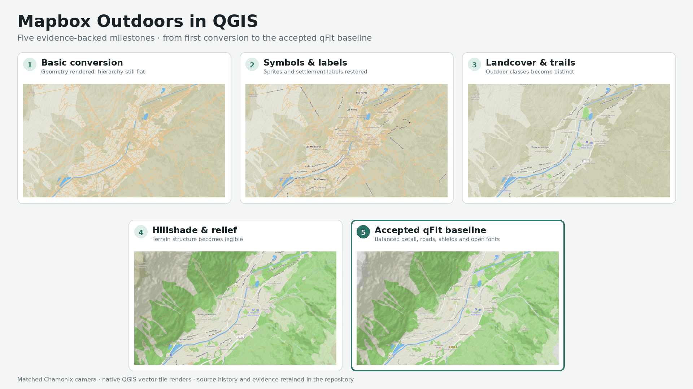
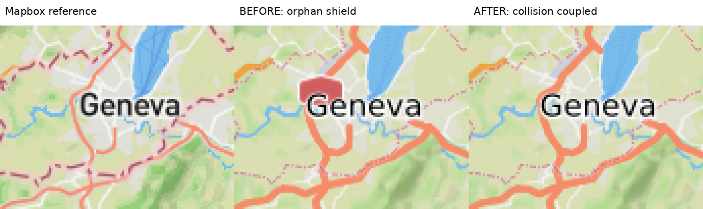
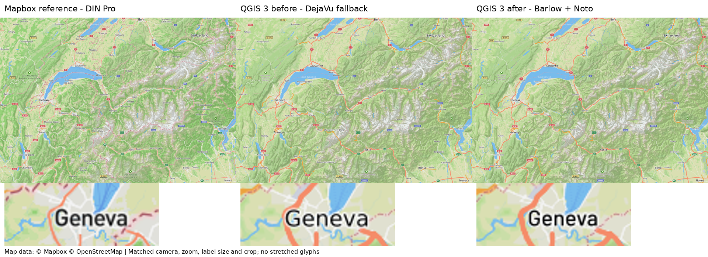

# QGIS Mapbox GL Style

QGIS plugin and validation harness for loading Mapbox vector tiles in QGIS and adapting Mapbox GL JS styles to the QGIS styling engine.

The first target style is Mapbox Outdoors (`mapbox/outdoors-v12`). The project keeps the qfit history that built the current QGIS symbology, then continues that work in a smaller repository focused only on Mapbox vector tiles and QGIS style parity.

## Style Maturity At A Glance

The curated Chamonix sequence shows only visually meaningful steps: first conversion, restored symbols and labels, landcover and trail separation, hillshade relief, and the latest qFit baseline with balanced contour/path detail. The final stage adds the September 2026 road hierarchy, source-correct shields, shield/label collision coupling, and portable Barlow/Noto typography.



The source history now includes the final work from qFit issues [#949](https://github.com/ebelo/qfit/issues/949) and [#1453](https://github.com/ebelo/qfit/issues/1453):

| Milestone | qFit work integrated | Visible result |
| --- | --- | --- |
| Roads | PRs [#1448](https://github.com/ebelo/qfit/pull/1448), [#1449](https://github.com/ebelo/qfit/pull/1449), [#1450](https://github.com/ebelo/qfit/pull/1450), [#1452](https://github.com/ebelo/qfit/pull/1452) | Better road-label sizing and a clearer z14 street hierarchy |
| Shields | PRs [#1454](https://github.com/ebelo/qfit/pull/1454)–[#1458](https://github.com/ebelo/qfit/pull/1458) | Source-correct shield colours and no orphan backgrounds after collision removal |
| Typography | PR [#1460](https://github.com/ebelo/qfit/pull/1460) | Portable Barlow roles with Noto script fallback in reproducible QGIS environments |

The qFit team accepted this Outdoors state at baseline [`63784d0`](https://github.com/ebelo/qfit/commit/63784d0) after the visual review loop. Acceptance means the remaining differences were documented and no longer blocked the project; it is not a claim of pixel-perfect browser parity.

Focused evidence remains available for the two changes that are hard to judge at Chamonix scale:

| Shield collision coupling | Portable typography |
| --- | --- |
|  |  |

See the [progression image notes](docs/images/style-progression/chamonix/README.md) and [`iterations/index.json`](iterations/index.json) for provenance and reproducible iteration metadata.

## What It Does

- adds a QGIS action to load Mapbox Outdoors as a vector tile layer
- fetches the Mapbox style JSON and sprite sheet at runtime
- simplifies Mapbox GL expressions that QGIS cannot convert directly
- applies the converted renderer and labeling with QGIS' `QgsMapBoxGlStyleConverter`
- post-processes labels, line styles, terrain fills, source-correct road shields, shield collisions, contour labels, paths, and other Outdoors-specific details from the qfit work
- maps proprietary DIN roles to portable Barlow faces with Noto script fallback in the reproducible rendering environments
- keeps an iteration manifest so historical and future style snapshots can be rendered and compared

No Mapbox token, tile payload, sprite payload, downloaded style JSON, or render output is committed.

## QGIS Plugin Use

Install or package the plugin as `qgis_mapbox_gl_style`.

The plugin reads the Mapbox token from QGIS settings first, then from environment variables:

```bash
export QGIS_MAPBOX_GL_STYLE_MAPBOX_TOKEN="pk..."
```

The generic `MAPBOX_ACCESS_TOKEN` variable is also supported. `QFIT_MAPBOX_ACCESS_TOKEN` remains supported only for old validation scripts and local migration continuity.

In QGIS:

1. Enable the plugin.
2. Open `QGIS Mapbox GL Style -> Settings`.
3. Enter a Mapbox token, style owner, style id, and tile mode.
4. Run `QGIS Mapbox GL Style -> Load Mapbox Outdoors`.

The default style is `mapbox/outdoors-v12` in vector mode.

## Iterations

Iterations are stored in `iterations/index.json`. Each entry records:

- a stable iteration id
- the original qfit commit
- the rewritten commit in this repository
- source pull requests and issue references
- the style owner/id and camera set
- notes about the visual/style milestone

List iterations:

```bash
python -m qgis_mapbox_gl_style.iterations list
```

Render one historical iteration:

```bash
python -m qgis_mapbox_gl_style.iterations render --iteration 006 --camera-set issue-949
```

The render command creates a detached git worktree at the selected filtered commit and runs the retained comparison harness from that snapshot. Artifacts are written under `debug/iterations/<iteration>/<timestamp>/`, which is ignored by git.

Use `--dry-run` to inspect the exact worktree and render command without executing QGIS/browser rendering.

Accept a future agent run as the next iteration:

```bash
python -m qgis_mapbox_gl_style.iterations accept --from-run debug/iterations/012/20260620T120000Z --label "Improve contour label placement"
```

That appends the next manifest entry against the current repository `HEAD`.

## Validation Harness

The retained validation scripts live under `validation/` and are intentionally close to their qfit originals. Some report fields still say `qfit_*` or "qfit preprocessing" because those names are part of the historical audit output and tests.

The main visual comparison harness is:

```bash
python validation/mapbox_outdoors_comparison.py --all-cameras --output-root debug/mapbox-outdoors-comparison
```

See [docs/mapbox-outdoors-comparison-harness.md](docs/mapbox-outdoors-comparison-harness.md) for the full harness workflow.

## Packaging

Build a QGIS install ZIP:

```bash
python scripts/package_plugin.py
```

The package is written to `dist/qgis_mapbox_gl_style-<version>.zip`.

## Provenance

This repository was seeded from the Mapbox/QGIS parts of `ebelo/qfit` with `git filter-repo`, so the style work remains inspectable as real git history instead of a copied final snapshot.

More detail is in [docs/provenance.md](docs/provenance.md).
